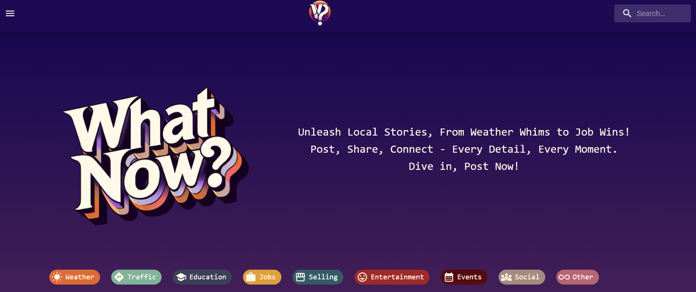
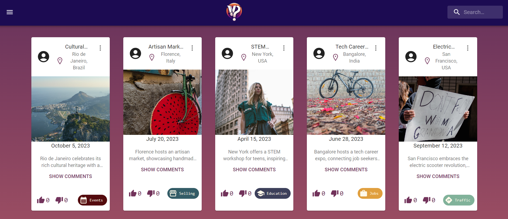
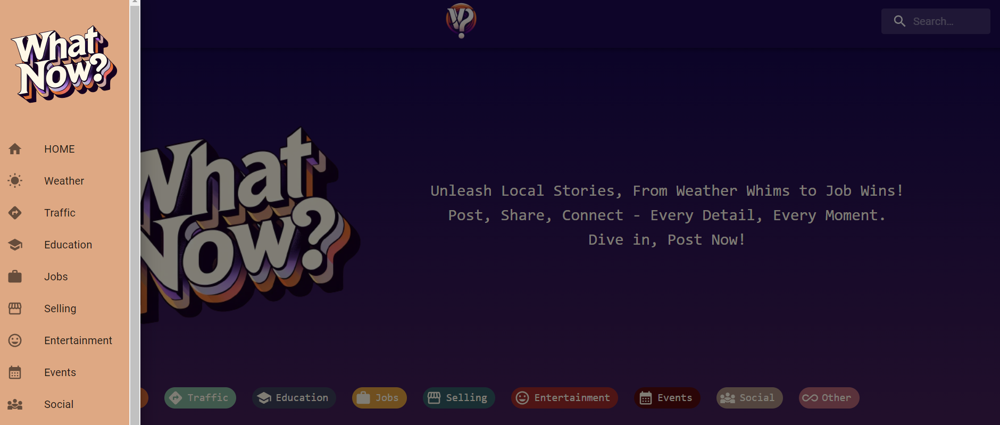

## WHAT NOW?

## DESCRIPTION

What now? is an interactive news portal in which users can write news snippets, edit and delete posts, as well as comment and like them. The site is organised as follows:

- a home page with all existing posts
- pages with posts filtered by category
- detailed pages of individual posts
- a Navigation Bar with a menu, search bar and page icon
- an about us page

Use our site to stay up to date with the newest events, weather and traffic updates, educational articles and more!

## INSTRUCTIONS 

    - use chips to filter posts by category
    - use the search bar to filter posts by title or location
    - toggle comments button to post and see comments
    - toggle settings button to edit or delete posts
    - use nav bar and dropdown menu to easily navigate through the page
    - use the plus sign to post your own news
    - have fun

## DEMO

https://what-now-portal.netlify.app/

## MVP

    [X] API
    [X] APP / MAIN / HOMEPAGE

    CRUD FUNCTIONALITY:
    [X] READ posts: HOMEPAGE (Render the different categories pages)
    [X] CREATE posts: Add Post (Inputs in the form: title, date, location, description, category, image)
    [X] DELETE posts: Remove existing posts
    [X] UPDATE posts: Edit existing posts

    CSS:
    [X] General style
    [X] Component style

    IMPROVEMENTS:
    [X] Search bar (to filter posts by title or loation)
    [X] Loader
    [X] Responsive behaviour
    [X] Comments
    [X] Likes and dislikes for posts
    [X] Order posts by date
    [X] Show a specific number of posts + 'show more' button
    [X] Delete button with overlay message: "Are you sure you want to remove this post?" "Yes / No"
    [X] Also on edit button.
    [X] Add prettier configuration
    [ ] Proper scroll down of the page
    [ ] Automatic removal of posts after x days

## OTHER

POSTS CATEGORIES:
- All
- Weather updates
- Selling
- Entertainment
- Events
- Traffic
- Social
- Job offers
- Education
- Other

NAVBAR components:
- Home
- Dropdown menu
- About us
- Styling

FOOTER component:
- Credentials

HOMEPAGE:
- Navbar
- Header
- Posts
- Footer
- Styling

CATEGORIES PAGE:
- Navbar
- Posts filtered by categories
- Footer

POST DETAILS PAGE:
- Navbar
- Title 
- Image 
- Location 
- Date 
- Description 
- Category
- Edit button 
- Delete button 
- Show more button 
- Style 
- Toggle comments
- Footer

